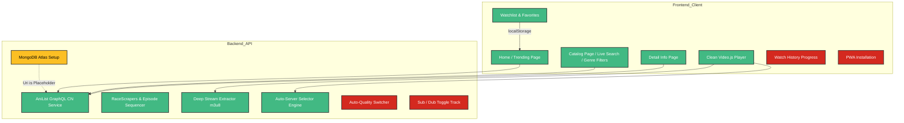

# 🗺️ DonghuaStream — Platform Mental Map

This mental map shows the current operational health of each module, active configurations, and future planned upgrades.

---

## 1. Visual Platform Map

---

## 2. Status Breakdown

### 🟢 Fully Operational Features (Production-Ready)
*   **Metadata Engine**: Powered directly by AniList GraphQL (filtered strictly to Chinese-originated shows).
*   **Catalog & Filters**: Live searching, sorting, and genre pagination are fully integrated.
*   **Deep Stream Extractor**: Scrapes `.m3u8` direct HLS video stream files from target embeds, bypassing third-party advertisement scripts.
*   **Smart Server Racing**: Backend queries all 4 servers concurrently, ranks them based on stream quality/safety, and auto-assigns the best default.
*   **Database-Free Operations**: Watchlists and Favorites store lists in browser `localStorage`. No external database is needed to run the platform.

### 🟡 Partially Working / Offline (Config Required)
*   **MongoDB Atlas**: The backend has disabled database connections because `.env` contains the default placeholder (`MONGO_URI=Mongodburl`). Watchlist actions gracefully fall back to local browser storage instead.

---

## 3. Future Roadmap (Planned Upgrades)

### 1. ⏱️ Watch History & Resume Playback
*   **Concept**: Keep track of the user's video playback timestamps (e.g. paused at 14:32 on Episode 15).
*   **Design**: Save timestamps locally in `localStorage`. When the user returns to the detail page, show a prominent **"Resume watching Ep 15"** button.

### 2. 🎚️ Direct Video Quality Controls
*   **Concept**: Allow users to manually select resolutions (1080p, 720p, 480p) inside our custom `Video.js` player container instead of relying on auto-resolution.

### 3. 🌐 Sub / Dub Audio Track Toggling
*   **Concept**: A navbar button allowing users to switch search parameters between English Subbed releases (default) and Chinese Raw audio tracks.

### 4. 📲 Progressive Web App (PWA) Support
*   **Concept**: Enable service worker caching and offline catalog checks so users can install DonghuaStream as a native desktop/mobile app.
