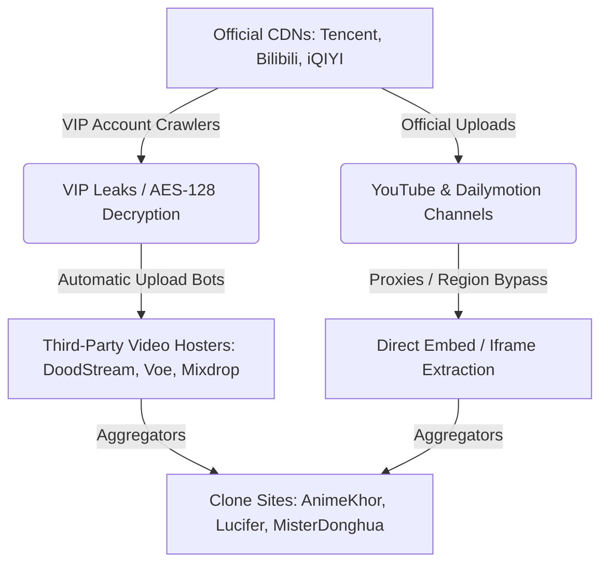

# 🕵️‍♂️ Reverse-Engineering Donghua Clone Sites: Video Source & CDN Analysis

This report analyzes how clone streaming sites (such as AnimeKhor, LuciferDonghua, and MisterDonghua) obtain their episode feeds, host their files, and bypass official protections.

---

## 1. Where Do Clone Sites Get Their Videos?

Chinese animation (Donghua) is heavily protected and hosted on major corporate CDNs (Tencent Video, Bilibili, iQIYI). To bypass these barriers, clone sites use three primary sourcing strategies:

### Strategy A: VIP Crawlers & CDN Leaking (Premium Rips)
- **The Method**: Clone site developers write specialized selenium/crawler scripts that log into official Chinese media platforms using paid premium (VIP) accounts.
- **The Leak**: These scripts capture the HLS stream playlist files (`.m3u8` index files) and their corresponding **AES-128 decryption keys** before the player session expires.
- **The Result**: The raw TS video chunks are downloaded from official CDNs (e.g. `*.bilivideo.com` or Tencent CDN nodes), remuxed, and prepared for re-hosting.

### Strategy B: Automated UGC Hosting Networks (Bulk File Storage)
Since hosting petabytes of high-definition video is extremely expensive, clone sites do **not** host video files on their own web servers. Instead, they use automated upload bots to transfer files to free, ad-supported hosting nodes:
- **Major Hosters**: DoodStream, Streamtape, Fembed, Voe.sx, Mixdrop, and Vidverto.
- **How they monetize**: These file hosts provide free storage and unlimited bandwidth to clone sites, but inject aggressive popunder advertisements and gambling redirects into the video player container to monetize the traffic.

### Strategy C: Bypassing Official YouTube & Dailymotion Channels
- **The Method**: Major studios (Bilibili, Tencent Animation, iQIYI) officially publish full episodes on YouTube/Dailymotion for international audiences, but region-lock them (e.g. blocked in Asia/China) or put them behind channel memberships.
- **Bypassing**: Clone sites run backend API search queries through proxy servers located in unlocked regions (e.g. Germany, US, Singapore) to scrape the video IDs, and then embed them directly.

---

## 2. Implementing the Auto-Server Selector Design

To deliver a premium user experience, we can implement a backend **Auto-Server Selector** in `getWatchUrl`:

1. **Parallel Resolution**: When a watch page requests an episode, the backend resolves streams from **all 4 servers** (AnimeKhor, LuciferDonghua, MisterDonghua, Dailymotion) in parallel.
2. **Quality Ranking**: The backend ranks the resolved links:
   - **Rank 1**: Direct `.m3u8` streams (highest quality, ad-free, runs in native `Video.js`).
   - **Rank 2**: Stable official embeds (Dailymotion, YouTube).
   - **Rank 3**: Third-party iframe embeds (ad-supported mirrors).
3. **Auto-Switching**: The backend automatically assigns the highest-ranked, working server as the active default stream (`videoUrl`), ensuring the player loads immediately with the best source, while returning the other servers as fallback choices.
